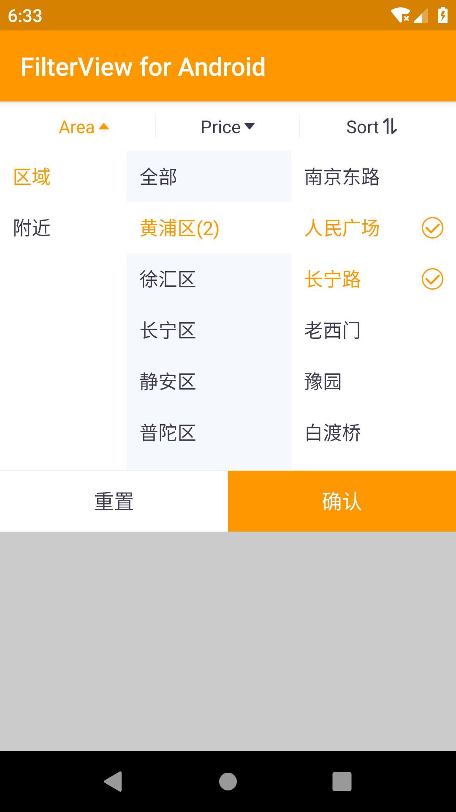

# Android-Filter-View

[  ](https://bintray.com/wuzongbo/maven/filterview/_latestVersion)
[](https://travis-ci.org/wzbos/Android-Filter-View)
[](http://jcenter.bintray.com/cn/wzbos/android/widget/filterview)

## Gradle Dependency

``` groovy
buildscript {
    repositories {
        jcenter()
    }
}
dependencies {
    implementation "cn.wzbos.android.widget:filterview:1.0.0"
}
```


## layout

&nbsp;&nbsp;&nbsp;


```java
 <com.wzbos.android.widget.filter.FilterGroupView
        android:layout_width="match_parent"
        android:layout_height="wrap_content"
        android:background="#ffffffff"
        android:divider="@drawable/divider"
        android:orientation="horizontal"
        android:padding="10dp"
        android:showDividers="middle">

        <com.wzbos.android.widget.filter.FilterView
            android:id="@+id/area_filter"
            android:layout_width="0dp"
            android:layout_height="match_parent"
            android:layout_weight="1"
            app:expandedViewHeight="300dp"
            app:text="Area" />

        <com.wzbos.android.widget.filter.FilterView
            android:id="@+id/price_filter"
            android:layout_width="0dp"
            android:layout_height="match_parent"
            android:layout_weight="1"
            app:expandedViewHeight="300dp"
            app:text="Price" />


        <com.wzbos.android.widget.filter.FilterView
            android:id="@+id/sort_filter"
            android:layout_width="0dp"
            android:layout_height="match_parent"
            android:layout_weight="1"
            app:collapseIcon="@mipmap/ic_filter_normal"
            app:expandedIcon="@mipmap/ic_filter_selected"
            app:expandedViewHeight="300dp"
            app:text="Sort" />
    </com.wzbos.android.widget.filter.FilterGroupView>
```

## setExpandedView

```java

FilterView filterView = findViewById(R.id.area_filter);
filterView.setExpandedView(view);

```
